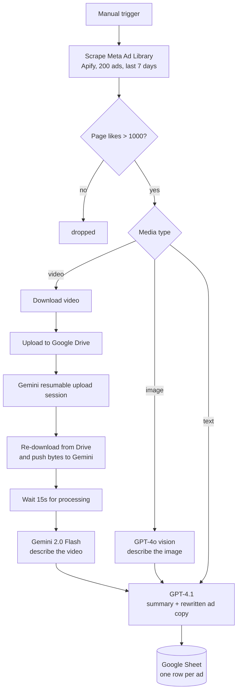

# Facebook Ads Spy Agent

An n8n workflow that scrapes the Meta Ad Library for a keyword, filters to advertisers with real
audience size, then runs every ad through a vision or video model to produce a written breakdown of
what the ad does and a rewritten version of its copy. Results land in a Google Sheet, one row per ad.

The point is competitive intelligence at volume: instead of scrolling the Ad Library by hand, you get
a searchable table of what everyone advertising against your keyword is running, described in enough
detail to brief a copywriter or a designer off the row alone.

## What it does



Three media paths, one output shape. The video path is the expensive one: Gemini's Files API needs the
video uploaded as bytes with a known content length, so the workflow parks the file in Drive first to
get a stable id and size, then streams it back out to Gemini.

## Sheet schema

The workflow appends to a sheet named `Ads` with these columns. Create them before the first run, in
any order, spelled exactly like this.

| Column | Contents |
| --- | --- |
| `ad_archive_id` | Meta's id for the ad, use it to dedupe |
| `page_id` | Advertiser page id |
| `type` | `video`, `image`, or `text` |
| `date_added` | Timestamp of the run |
| `page_name` | Advertiser name |
| `page_url` | Advertiser profile URL |
| `summary` | Analytical breakdown of the ad |
| `rewritten_ad_copy` | The same angle, rewritten |
| `image_prompt` | GPT-4o's description of the creative, image ads only |
| `video_prompt` | Gemini's shot-by-shot description, video ads only |

The two `*_prompt` columns are the useful ones for production work. They are detailed enough to hand
to an image or video generator as a starting brief.

## Setup

1. Import `workflow/facebook-ads-spy-agent.json` into n8n (Workflows, then Import from File).
2. Create the Google Sheet with the columns above, then set the document id on all three
   `Add as Type = ...` nodes. The exported file has `YOUR_GOOGLE_SHEET_ID` in that slot.
3. Connect three credentials, each currently pointing at a `REPLACE_WITH_YOUR_CREDENTIAL_ID`
   placeholder: Google Drive OAuth2, Google Sheets OAuth2, and OpenAI.
4. Fill in two API keys that are **not** stored as n8n credentials. Both appear as `<yourApiKey>`:
   - Apify token in `Scrape Meta Ad Library` (Authorization header)
   - Gemini API key in `Begin Gemini Upload Session`, `Upload Video to Gemini`, and
     `Analyze Video with Gemini` (query parameter `key`, so three places)
5. Edit the Ad Library search URL in `Scrape Meta Ad Library`. The shipped example searches the exact
   phrase `"ai automation"` in the US. Build the URL you want in the Ad Library UI and paste it in.
6. Run it manually once with `count` lowered to about 10 before you point it at 200.

### Search configuration

The Apify call takes the Ad Library URL verbatim, so anything the Ad Library UI can filter on
(country, keyword vs advertiser, exact phrase, date range, media type) is set by building the search
there and copying the address bar. The JSON body controls the rest: `count` caps results, `period` is
the lookback, and `scrapePageAds.activeStatus: active` keeps it to ads currently running.

## Costs and limits

Worth knowing before pointing this at a large keyword.

- **Apify bills per result.** 200 ads per run, every run, whether or not they survive the likes filter.
  The filter runs after the scrape, so you pay for the ads you throw away.
- **The loops are sequential.** Each `Loop Over ...` node processes one ad at a time with a one second
  pause between iterations, and the video path adds a fixed 15 second wait plus a Drive round trip. A
  video-heavy run of 200 ads is measured in hours, not minutes. This is the first thing to change if
  you want throughput: raise the batch size and parallelize the image and text paths, which have no
  ordering constraint between items.
- **Drive fills up silently.** Every scraped video is uploaded to the root of My Drive as
  `Example File` and never deleted. Add a cleanup step, or expect to clear it out by hand.
- **The 15 second wait is a guess, not a poll.** Gemini's Files API needs the upload to finish
  processing before `generateContent` will accept the file URI. Long or large videos will still be in
  `PROCESSING` when the analyze call fires, and it fails. The robust fix is to poll `files.get` until
  the state is `ACTIVE` instead of waiting a fixed interval.
- **Two keys sit in plaintext.** The Apify token and Gemini key are typed into HTTP Request node
  parameters rather than stored as credentials, which means they travel in any workflow export and are
  visible to anyone with n8n access. Moving both to n8n credentials (generic header auth for Apify,
  query auth for Gemini) is the right hardening step.
- **Models are pinned.** `gemini-2.0-flash`, `gpt-4o` for image description, `gpt-4.1` for the written
  summary. Nothing breaks if you move them up, and the summary node is the one most worth upgrading.

## Re-exporting

`scripts/export_workflow.py` pulls the workflow from n8n and strips instance-specific state (workflow
id, version counters, credential ids, the Google Sheet id) so the committed copy stays importable by
anyone. It refuses to write if it finds anything shaped like a live API key.

```bash
export N8N_BASE_URL=https://your-instance.app.n8n.cloud
export N8N_API_KEY=...
python3 scripts/export_workflow.py --id YOUR_WORKFLOW_ID
```

It also takes `--file raw-export.json` if you exported from the n8n UI instead.

## Repo layout

```
workflow/facebook-ads-spy-agent.json   the importable workflow, sanitized
scripts/export_workflow.py             pull from n8n and re-sanitize
.env.example                           env vars for the export script only
```

Nothing in this repo holds a secret. The workflow's own keys live in n8n.
